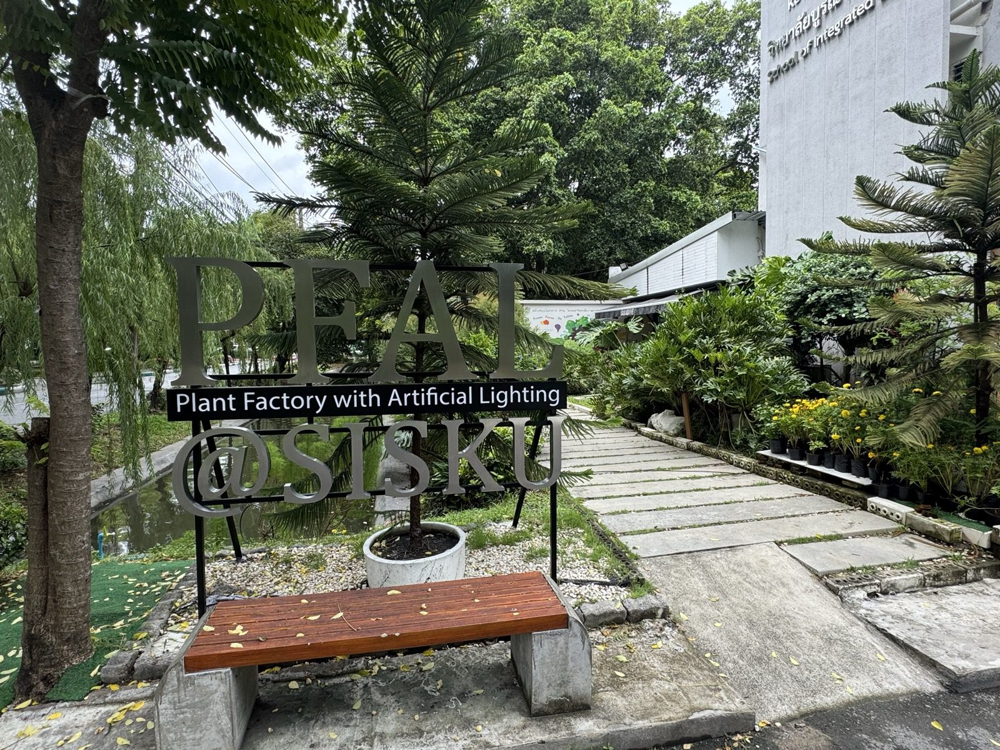

<p align="center"></p>

# SIS PFAL Digital Twin

**โครงการโรงประลอง (Rong Pralong) · วิทยาลัยบูรณาการศาสตร์ มหาวิทยาลัยเกษตรศาสตร์**
*Rong Pralong project · School of Integrated Science, Kasetsart University*

🌐 **Web app:** https://sis-pfal-digital-twin.streamlit.app

<p align="center"></p>

## ทำไมต้องมี web app นี้
**SIS PFAL** คือห้องปลูกพืชระบบปิดด้วยแสงเทียม (plant factory with artificial lighting) ของวิทยาลัยฯ — ห้องขนาด 7.1 × 3.0 ม. มีชั้นปลูก 5 ชั้น (700 หลุมปลูกบนชั้น 2–5) ควบคุมด้วยระบบ IoT ที่ส่งค่าอุณหภูมิ ความชื้น CO₂ EC/pH และสถานะปั๊ม/ไฟ ขึ้น dashboard ตลอดเวลา

dashboard เดิมบอกได้ว่า *ตัวเลขตอนนี้เป็นเท่าไร* แต่ไม่บอกว่า *ค่านั้นอยู่ตรงไหนของห้อง*, *เมื่อวานหรือเดือนก่อนเป็นอย่างไร* และ *ถ้าเปลี่ยนวิธีปลูกจะเกิดอะไร* — แอปนี้จึงสร้าง **digital twin**: แบบจำลอง 3 มิติของห้องจริง (สแกนด้วย LiDAR) ที่ผูกกับข้อมูลเซ็นเซอร์จริง เพื่อให้ทีมงาน นิสิต และผู้เยี่ยมชมเข้าใจห้องได้จากหน้าจอเดียว

| หน้า | ใช้ทำอะไร |
|---|---|
| **Overview** | ภาพห้องและคำอธิบายสั้น ๆ ว่าแอปทำอะไรได้ |
| **Live** | กราฟค่าปัจจุบัน (T/RH 5 จุด, CO₂, EC/pH + set-point, การจ่ายปุ๋ย) รีเฟรชทุกนาที + ห้อง 3 มิติระบายสีตามค่าที่วัดได้จริง |
| **History** | เลื่อนดูสภาพห้อง ณ เวลาใดก็ได้ตั้งแต่ ธ.ค. 2025, กราฟย้อนหลัง, สรุปตัวชี้วัด, เหตุการณ์ผิดปกติ, ดาวน์โหลด CSV |
| **Layout & water** | ผังห้องตามที่สร้างจริง ระบบท่อน้ำ/สารอาหาร และแอนิเมชันการไหล |
| **What-if** | ทดลองสัดส่วนผักบน 700 หลุม (ผังรายหลุม 3 มิติ + ผลผลิต/รายได้/แสงที่ต้องการ) และสถานการณ์ชั่วโมงเปิดไฟ × หรี่ไฟ → พลังงาน |

## ข้อมูลมาจากไหน / เก็บไว้ที่ไหน
- **ค่าสด**: ดึงตรงจาก ThingsBoard (dashboard *Vertical Smart Farming* ของ Civic Agrotech) ทุก 60 วินาที
- **ประวัติ**: GitHub Actions ดึงข้อมูลใหม่จาก ThingsBoard **ทุก 30 นาที** แล้วเก็บไว้ที่ branch [`data`](../../tree/data) ของ repo นี้ (ตาราง 10 นาที + ข้อมูลดิบ ตั้งแต่ 26 ธ.ค. 2025; แอปแสดงตั้งแต่ **13 มิ.ย. 2026** ซึ่งเป็นวันเริ่มเดินระบบต่อเนื่อง) — แอปตรวจของใหม่ทุก 10 นาที
- **รูปทรงห้อง**: จากการสแกน LiDAR หน้างาน 13 ก.ย. 2026 (ไฟล์สแกนและภาพถ่ายไม่อยู่ใน repo)

## ดาวน์โหลดข้อมูล
ข้อมูลทั้งหมดเปิดให้ดาวน์โหลด (อัปเดตทุก 30 นาที) — ตั้งแต่ **26 ธ.ค. 2025** ถึงปัจจุบัน
| ไฟล์ | เนื้อหา |
|---|---|
| [iot_10min.parquet](../../raw/data/data/processed/iot_10min.parquet) | ตาราง 10 นาที ทุกตัวแปร (≈2 MB) — หรือกด "download the whole store" ในหน้า History ของแอปเพื่อรับเป็น CSV |
| [thingsboard_long.parquet](../../raw/data/data/raw/iot/thingsboard_long.parquet) | ข้อมูลดิบทุกตัวอย่างตามที่อุปกรณ์ส่ง (≈13 MB) |
| [store_manifest.json](../../raw/data/data/processed/store_manifest.json) | เวลาอัปเดตล่าสุดและช่วงข้อมูล |
| [docs/DATA_DICTIONARY.md](docs/DATA_DICTIONARY.md) | ความหมายของทุกคอลัมน์ |

## รันเองในเครื่อง
```bash
pip install -r requirements.txt
streamlit run app/streamlit_app.py
```

## ข้อจำกัดที่ควรรู้
- ส่วน *What-if* ใช้พารามิเตอร์เชิงสมมติ (ยังไม่สอบเทียบกับ PPFD, จำนวนหลอด LED และน้ำหนักเก็บเกี่ยวจริง) — ใช้เปรียบเทียบทางเลือก ไม่ใช่ตัวเลขอ้างอิง
- Gateway ของเซ็นเซอร์อุณหภูมิ/ความชื้นส่งค่าไม่สม่ำเสมอในบางช่วง กราฟจึงมีช่องว่างได้ตามสภาพจริง

---
ความหมายของทุกตัวแปรอยู่ใน [`docs/DATA_DICTIONARY.md`](docs/DATA_DICTIONARY.md); API ของ twin ดูที่ docstring ของ [`pfal_twin/twin.py`](pfal_twin/twin.py)
