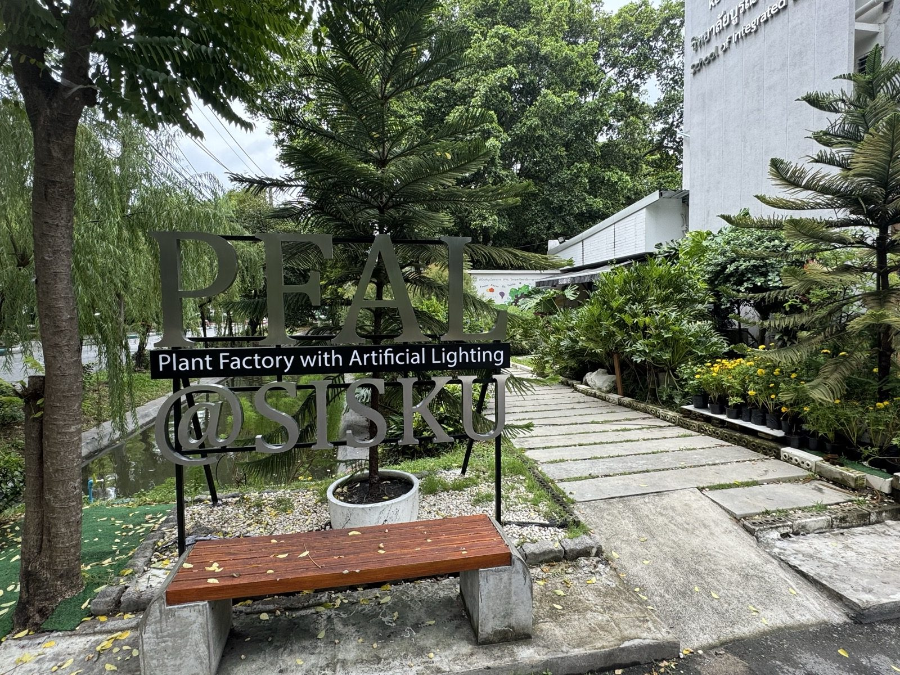

<p align="center"></p>

# SIS PFAL Digital Twin

**โครงการโรงประลอง (Fab Lab) · วิทยาลัยบูรณาการศาสตร์ มหาวิทยาลัยเกษตรศาสตร์**
*Fab Lab project · School of Integrated Science, Kasetsart University*

🌐 **Web app:** https://sis-pfal-digital-twin.streamlit.app

<p align="center"></p>

## ทำไมต้องมี web app นี้
**SIS PFAL** คือห้องปลูกพืชระบบปิดด้วยแสงเทียม (plant factory with artificial lighting) ของวิทยาลัยฯ — ห้องขนาด 7.1 × 3.0 ม. มีชั้นปลูก 5 ชั้น (720 หลุมปลูกบนชั้น 2–5 — ชั้นละ 6 × 30 หลุม) ควบคุมด้วยระบบ IoT ที่ส่งค่าอุณหภูมิ ความชื้น CO₂ EC/pH และสถานะปั๊ม/ไฟ ขึ้น dashboard ตลอดเวลา

dashboard เดิมบอกได้ว่า *ตัวเลขตอนนี้เป็นเท่าไร* แต่ไม่บอกว่า *ค่านั้นอยู่ตรงไหนของห้อง*, *เมื่อวานหรือเดือนก่อนเป็นอย่างไร* และ *ถ้าเปลี่ยนวิธีปลูกจะเกิดอะไร* — แอปนี้จึงสร้าง **digital twin**: แบบจำลอง 3 มิติของห้องจริง (สแกนด้วย LiDAR) ที่ผูกกับข้อมูลเซ็นเซอร์จริง เพื่อให้ทีมงาน นิสิต และผู้เยี่ยมชมเข้าใจห้องได้จากหน้าจอเดียว

| หน้า | ใช้ทำอะไร |
|---|---|
| **Overview** | ภาพห้องและคำอธิบายสั้น ๆ ว่าแอปทำอะไรได้ |
| **Live** | กราฟค่าปัจจุบัน (T/RH 5 จุด, CO₂, EC/pH + set-point, การจ่ายปุ๋ย) รีเฟรชทุกนาที + ห้อง 3 มิติระบายสีตามค่าที่วัดได้จริง |
| **History** | เลื่อนดูสภาพห้อง ณ เวลาใดก็ได้ตั้งแต่ ธ.ค. 2025, กราฟย้อนหลัง, สรุปตัวชี้วัด, เหตุการณ์ผิดปกติ, ดาวน์โหลด CSV |
| **Layout & water** | ผังห้องตามที่สร้างจริง ระบบท่อน้ำ/สารอาหาร และแอนิเมชันการไหล |
| **What-if** | ทดลองสัดส่วนผักบน 720 หลุม (ผังรายหลุม 3 มิติ + ผลผลิต/รายได้/แสงที่ต้องการ) และสถานการณ์ชั่วโมงเปิดไฟ × หรี่ไฟ → พลังงาน |

## ข้อมูลมาจากไหน / เก็บไว้ที่ไหน
- **ค่าสด**: ดึงตรงจาก ThingsBoard (dashboard *Vertical Smart Farming* ของ Civic Agrotech) ทุก 60 วินาที
- **ประวัติ**: GitHub Actions ดึงข้อมูลใหม่จาก ThingsBoard **ทุก 30 นาที** แล้วเก็บลง **ฐานข้อมูล SIS PFAL** (MariaDB `pfal` ผ่าน PFAL SQL API ของวิทยาลัยฯ — ตาราง `iot_10min`, `iot_long`, `store_meta`) และสำรองไว้ที่ branch [`data`](../../tree/data) ของ repo นี้ (ตาราง 10 นาที + ข้อมูลดิบ ตั้งแต่ 26 ธ.ค. 2025; แอปแสดงตั้งแต่ **13 มิ.ย. 2026** ซึ่งเป็นวันเริ่มเดินระบบต่อเนื่อง) — แอปอ่านจากฐานข้อมูลทุก 10 นาที ถ้าต่อไม่ได้จะใช้ branch `data` แทน
- **รหัสฐานข้อมูล**: `.streamlit/secrets.toml` ในเครื่อง (ส่วน `[pfal_db]`, ไม่ถูก commit), GitHub secrets `PFAL_DB_USER` / `PFAL_DB_PASS` และ Secrets ของแอปบน Streamlit Cloud — ตรวจการเชื่อมต่อด้วย `scripts/check_db.py`
- **รูปทรงห้อง**: จากการสแกน LiDAR หน้างาน 13 ก.ย. 2026 (ไฟล์สแกนและภาพถ่ายไม่อยู่ใน repo)

## ดาวน์โหลดข้อมูล
หน้า **History** ของแอป → "download the whole store" — ตั้งแต่ **26 ธ.ค. 2025** ถึงปัจจุบัน (อัปเดตทุก 30 นาที)
| ปุ่ม | เนื้อหา |
|---|---|
| 10-min table — CSV / Parquet | ตาราง 10 นาที ทุกตัวแปร |
| raw samples | ข้อมูลดิบทุกตัวอย่างตามที่อุปกรณ์ส่ง (≈11 MB, อ่านจากฐานข้อมูลเมื่อกด) |
| data dictionary | ความหมายของทุกคอลัมน์ ([docs/DATA_DICTIONARY.md](docs/DATA_DICTIONARY.md)) |

## ขอบเขตของ repo นี้
เก็บเฉพาะสิ่งที่ web app ต้องใช้: โค้ด (`app/`, `pfal_twin/`), โมเดลห้องและแผนที่เซ็นเซอร์ (`data/model`, `data/sensors`), ตารางข้อมูล 10 นาที (`data/processed`) และสคริปต์อัปเดต (`scripts/`, `.github/workflows`) — ไฟล์สแกน LiDAR, ภาพถ่ายหน้างาน, แบบแปลน, notebook ของ pipeline และรูปวิเคราะห์ อยู่นอก GitHub (ขอได้จากผู้ดูแลโครงการ)

## Checkpoint / ย้อนเวอร์ชัน
เวอร์ชันที่ตรวจแล้วว่าใช้งานได้ถูก tag ไว้ (ล่าสุด: `v1.0` = 16 ก.ย. 2026) และ branch `stable` ชี้ที่เวอร์ชันเดียวกัน
ถ้าเวอร์ชันบน `main` มีปัญหา: (ก) ใน Streamlit Cloud เปลี่ยน branch ของแอปเป็น `stable` ได้ทันที หรือ (ข) ในเครื่อง `git checkout main && git reset --hard v1.0 && git push --force origin main`

## รันเองในเครื่อง
```bash
pip install -r requirements.txt
streamlit run app/streamlit_app.py
```

## ข้อจำกัดที่ควรรู้
- ส่วน *What-if* ใช้พารามิเตอร์เชิงสมมติ (ยังไม่สอบเทียบกับ PPFD และน้ำหนักเก็บเกี่ยวจริง; LED ชั้น 2–5 ชั้นละ 30 หลอด × 42 W, nursery 2 มี 21 หลอด, nursery 1 มี 6 หลอด T8 ECO 18 W) — ใช้เปรียบเทียบทางเลือก ไม่ใช่ตัวเลขอ้างอิง
- Gateway ของเซ็นเซอร์อุณหภูมิ/ความชื้นส่งค่าไม่สม่ำเสมอในบางช่วง กราฟจึงมีช่องว่างได้ตามสภาพจริง

---
ความหมายของทุกตัวแปรอยู่ใน [`docs/DATA_DICTIONARY.md`](docs/DATA_DICTIONARY.md); API ของ twin ดูที่ docstring ของ [`pfal_twin/twin.py`](pfal_twin/twin.py)
